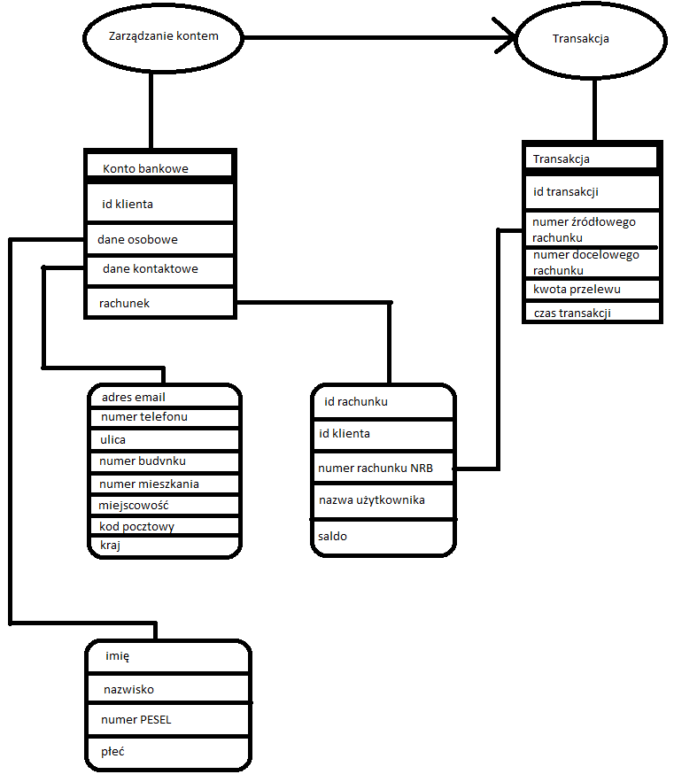

# TBO Lab 1
Zadanie DDD polega na zamodelowaniu fragmentu bezpiecznej aplikacji bankowej korzystając z zasad Domain Driven Design.
Zgodnie z tym podejściem zamodelowana został fragment biznesowej dziedziny aplikacji.

## Bounded Context
W Kontekście zawierają się:
- zarządzanie kontem (wszelkie operacje związane z kontami),
- transakcje (operacje dotyczące przelewów środków między kontami).
  
Definiuje on granice, w których używane będą terminy i pojęcia biznesowe.

## Agregaty, Encje i Obiekty Wartości
Ustalone zostały Agregaty (grupy powiązanych ze sobą obiektów, które tworzą wspólną całość i są traktowane jako jednostka zmiany stanu), Encje (obiekty reprezentujące konkretne, indywidualne, unikalne i trwałe pojęcia biznesowe) oraz Obiekty Wartości (obiekty reprezentujące zestawy wartości, które są niezmienne).

### Agregaty

- Konto bankowe
- Transakcja

### Encje

Klient:
- id klienta,
- dane osobowe,
- dane kontaktowe.

Rachunek:
- id rachunku,
- id klienta,
- numer rachunku NRB,
- nazwa użytkownika,
- saldo.

Transakcja:
- id transakcji,
- numer źródłowego rachunku,
- numer docelowego rachunku,
- kwota przelewu,
- czas transakcji.

### Obiekty Wartości

Dane osobowe:
- imię,
- nazwisko,
- numer PESEL,
- płeć

Dane kontaktowe:
- adres email,
- numer telefonu,
- ulica,
- numer budynku,
- numer mieszkania,
- miejscowość,
- kod pocztowy,
- kraj.

## Założenia
Założenia zadania przedstawione zostały w tabelce:

| Encja/Obiekt Wartości | Atrybuty          | Opis                     |
|-----------------------|-------------------|--------------------------|
| Klient                | id                | string, unikatowy dla wszystkich użytkowników |
| Dane Osobowe          | imię              | string o długości [2,60] (najdłuższe imię ma 57 liter) |
| Dane Osobowe          | nazwisko          | string o długości [2,60] |
| Dane Osobowe          | numer PESEL       | string o długości 11, weryfikowane cyfry kontrolne  |
| Dane Osobowe          | płeć              | string ze zbioru {"f", "m", "x} |
| Dane Kontaktowe       | adres email       | string o maksymalnej długości 255 znaków składający się z liter, cyfr, znaków {'+', '-', '_', '~'}, musi zawierać 1 znak "@" i konczyć się domeną |
| Dane Kontaktowe       | numer telefonu    | string składający się z 9 cyfr (zakładam tylko numery polskie) |
| Dane Kontaktowe       | ulica             | string o długości [2,60] |
| Dane Kontaktowe       | numer budynku     | string rozpoczynający się od dodatniej liczby, kończący na ewentualnej literze |
| Dane Kontaktowe       | numer mieszkania  | int                       |
| Dane Kontaktowe       | miejscowość       | string o długości [2,60]  |
| Dane Kontaktowe       | kod pocztowy      | string w formacie "dd-ddd", gdzie d - cyfra |
| Rachunek              | id                | string, unikatowy dla wszystkich rachunków |
|                       | id klienta        | string, id klienta, który jest zarejestrowany w danym banku |
|                       | numer rachunku    | string, zgodny z NRB (26 cyfr + suma kontrolna) |
|                       | nazwa użytkownika | string o długości [1,127] ustawiany przez klienta |
|                       | saldo             | float z określoną przez bank precyzją |
| Transakcja            | id                | string, unikatowy dla każdej transakcji |
|                       | numer źródłowego rachunku | string, zgodny z NRB (26 cyfr + suma kontrolna) |
|                       | numer docelowego rachunku | string, zgodny z NRB (26 cyfr + suma kontrolna) |
|                       | kwota przelewu    | float z określoną przez bank precyzją |\
|                       | czas transakcji   | string, format "yyyy-MM-dd HH:mm:ss" |
